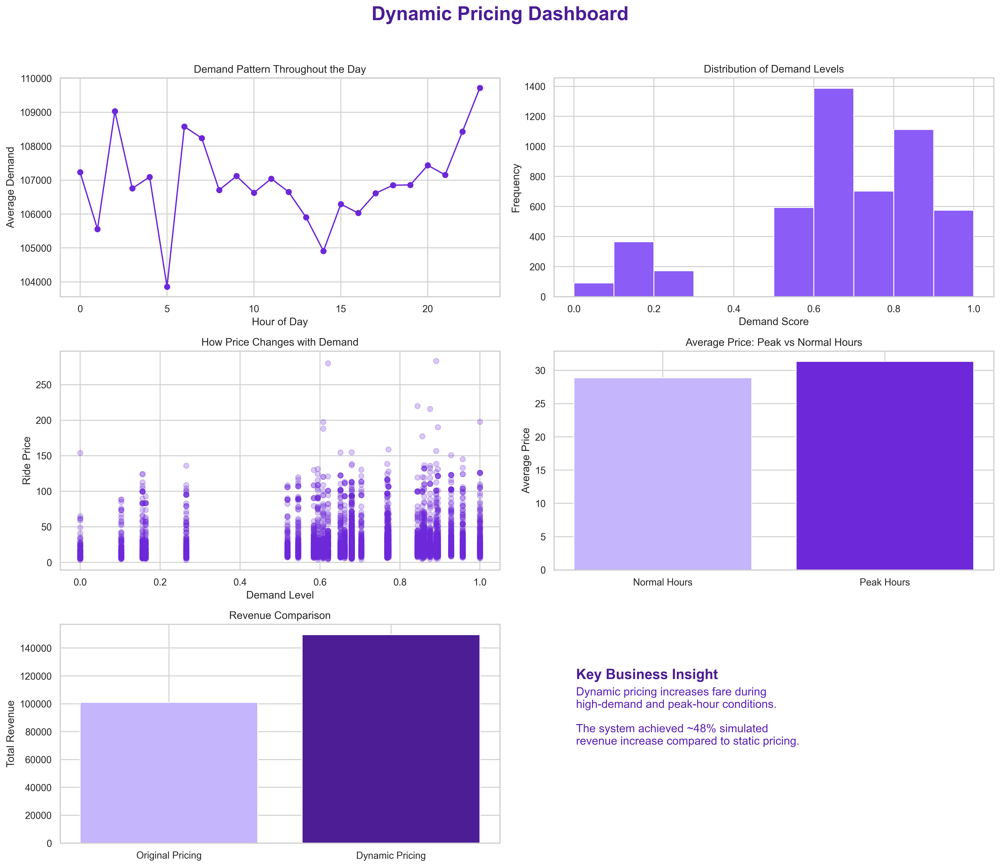

# Dynamic Fare Pricing ML Engine

This project builds a machine learning-based dynamic fare pricing system inspired by ride-hailing platforms.

The system predicts ride prices using demand, time-based patterns, and trip-related features. It also simulates dynamic pricing and compares it with static pricing to understand the possible revenue impact.

## Project Overview

Ride-hailing prices often change based on demand, peak hours, traffic, and other real-world conditions. This project explores that idea by building a pricing workflow that combines data preprocessing, exploratory analysis, model development, and business insight generation.

The project includes a Jupyter Notebook, preprocessing script, dashboard image, and a written insights report.

## Dashboard Preview



## Objectives

- Build a predictive model for ride fare pricing.
- Analyze demand variation across different hours of the day.
- Understand the relationship between demand and ride price.
- Simulate a demand-based dynamic pricing strategy.
- Compare dynamic pricing with static pricing.
- Evaluate potential revenue improvement from dynamic pricing.

## Tech Stack

- Python
- Pandas
- NumPy
- Matplotlib
- Seaborn
- Scikit-learn
- Jupyter Notebook

## Files in This Repository

```text
dynamic _pricing_ml_model.ipynb     Main notebook for analysis, modeling, and dashboard creation
dynamic_pricing_dashboard.png       Dashboard image summarizing the project results
INSIGHTS.md                         Detailed written insights from the analysis
src/data_preprocessing.py           Data preprocessing script
README.md                           Project documentation
```

## Dataset

This project uses publicly available datasets related to ride trips, weather, and traffic.

Datasets referenced:

```text
NYC Taxi Trip Data
India Weather Dataset
Bangalore Traffic Dataset
```

Due to file size and licensing constraints, the raw datasets are not included in this repository.

To run the project locally:

1. Download the required datasets from their original sources.
2. Place them in a local `data/` folder.
3. Update file paths in the notebook or preprocessing script if needed.

## Workflow

### Data Preprocessing

- Cleaned and structured trip-related data.
- Removed missing values and duplicate records.
- Filtered outliers in fare and demand-related fields.
- Converted timestamp columns into useful time-based features.
- Prepared data for analysis and machine learning.

### Feature Engineering

- Extracted hour of day.
- Created day-of-week features.
- Created peak-hour indicators.
- Derived demand score.
- Built temporal and demand-based features for fare prediction.

### Exploratory Data Analysis

- Analyzed demand variation across different hours.
- Studied the distribution of demand scores.
- Compared ride pricing across demand levels.
- Compared peak-hour and normal-hour price behavior.
- Examined revenue behavior under static and dynamic pricing.

### Model Development

- Built regression-based fare prediction models.
- Used demand and time-based features for price prediction.
- Evaluated model behavior using pricing-related patterns.

### Dynamic Pricing Simulation

- Adjusted fares based on demand levels.
- Compared dynamic pricing revenue with static pricing revenue.
- Estimated the business value of demand-responsive pricing.

## Dashboard Overview

The dashboard visualizes:

- Average demand by hour
- Demand score distribution
- Demand vs ride price relationship
- Peak-hour vs normal-hour pricing
- Static pricing vs dynamic pricing revenue
- Simulated revenue improvement

## Key Insights

### Demand Changes Throughout the Day

Demand is not constant across hours. Some time periods show higher demand concentration, making fixed pricing less effective.

### Demand Is a Strong Pricing Signal

Higher demand levels are generally associated with higher ride prices. This makes demand an important feature for fare prediction.

### Peak Hours Increase Fare Behavior

Peak-hour rides show higher average pricing compared to normal-hour rides. This supports the use of peak-hour indicators in the pricing model.

### Dynamic Pricing Improves Revenue

The simulation shows that demand-based dynamic pricing can generate higher revenue than static pricing by adjusting fares according to demand intensity.

### Controlled Price Flexibility Matters

Dynamic pricing should not increase every fare equally. It should respond smoothly to demand levels so that pricing remains logical and explainable.

## How to Use This Project

Clone the repository:

```bash
git clone https://github.com/aishidutta13/dynamic-fare-pricing-ml-engine.git
cd dynamic-fare-pricing-ml-engine
```

Open the notebook:

```text
dynamic _pricing_ml_model.ipynb
```

Run the notebook cells in order to view the full analysis, model workflow, and dashboard generation.

Run the preprocessing script:

```bash
python src/data_preprocessing.py
```

## Project Structure

```text
dynamic-fare-pricing-ml-engine/
│
├── dynamic _pricing_ml_model.ipynb
├── dynamic_pricing_dashboard.png
├── INSIGHTS.md
├── README.md
└── src/
    └── data_preprocessing.py
```

## Business Use Cases

- Ride-hailing fare optimization
- Demand-based price simulation
- Revenue impact analysis
- Peak-hour pricing strategy
- Transportation analytics
- Machine learning pricing model practice

## Current Limitations

- Raw datasets are not included in the repository.
- The project is notebook-based and not deployed as an application.
- Dynamic pricing is simulated, not connected to real-time APIs.
- External traffic and weather data may require path updates before running locally.

## Future Improvements

- Add real-time traffic and weather API integration.
- Use advanced models such as Gradient Boosting or XGBoost.
- Deploy the pricing engine as an interactive web application.
- Add model evaluation metrics in a separate report.
- Improve outlier handling for extreme fares and demand spikes.
- Add an API endpoint for fare prediction.

## Conclusion

This project demonstrates how machine learning and demand-based rules can support dynamic fare pricing. The analysis shows that pricing can become more responsive and revenue-aware when demand, time, and peak-hour behavior are included in the pricing workflow.

## Author

Aishi Dutta

GitHub: [aishidutta13](https://github.com/aishidutta13)
